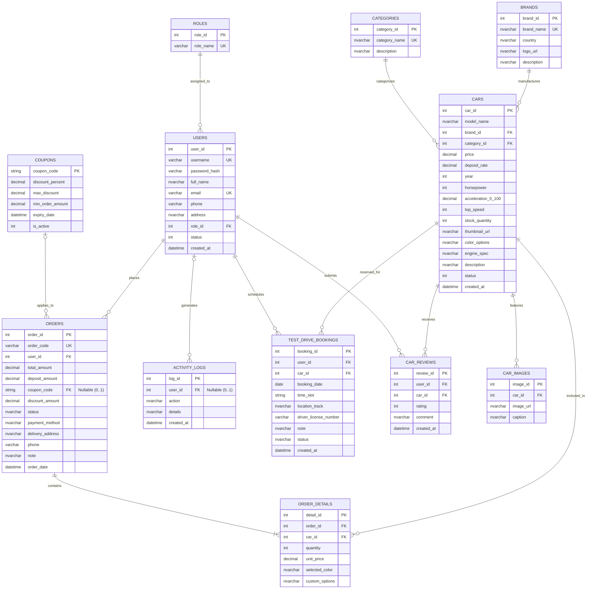

# HYPERCAR SALE SYSTEM - JAVA WEB JSP/SERVLET (PRJ301 ASSIGNMENT)

Hệ thống Website Thương mại Điện tử & Dịch vụ VIP dành cho **Siêu Xe (Hypercar & Megacar)** được xây dựng theo kiến trúc **MVC-V2 chuẩn mực**, sử dụng thuần công nghệ Java EE, JSP/Servlet, JDBC và CSDL Microsoft SQL Server.

---

## 🗄️ THIẾT KẾ CƠ SỞ DỮ LIỆU & SƠ ĐỒ THỰC THỂ QUAN HỆ (ERD CHUẨN HOÁ 3NF)

### 🎯 Giải Thích Tính Toàn Vẹn & Đồng Nhất 100% Giữa ERD và SQL:
1. **`USERS` — `ACTIVITY_LOGS` (`|o--o{`)**: Quan hệ **`0..1` đến `0..N`**. Khóa ngoại `ActivityLogs.user_id` có tính chất `NULL` và `ON DELETE SET NULL`, cho phép ghi nhận các sự kiện hệ thống toàn cục (System Audit, Guest Request) mà không bắt buộc phải liên kết với một user cụ thể.
2. **`COUPONS` — `ORDERS` (`|o--o{`)**: Quan hệ **`0..1` đến `0..N`**. Khóa ngoại `Orders.coupon_code` có tính chất `NULL`, cho phép tạo đơn hàng mà không cần áp dụng mã giảm giá.
3. **`ORDERS` — `ORDER_DETAILS` (`||--|{`)**: Quan hệ **`1..1` đến `1..N`**. Mỗi đơn hàng đặt cọc bắt buộc phải có ít nhất **1 siêu xe**.
4. **`USERS` — `CAR_REVIEWS` (`||--o{`)**: Ràng buộc `UNIQUE(user_id, car_id)` đảm bảo mỗi khách hàng VIP chỉ đánh giá một mẫu xe đúng 1 lần duy nhất.

---

## 💎 ĐẶC ĐIỂM NỔI BẬT & QUY MÔ DỰ ÁN

1. **Quy mô CSDL (11 Bảng chuẩn 3NF)**:
   * `Roles`, `Users`, `Brands`, `Categories`, `Cars`, `CarImages`, `Coupons`, `Orders`, `OrderDetails`, `TestDriveBookings`, `CarReviews`, `ActivityLogs`.
2. **Tuân thủ tuyệt đối danh mục thư viện được phép**:
   * `mssql-jdbc` (Driver kết nối SQL Server thuần).
   * `jBCrypt` (Mã hoá mật khẩu).
   * `Jackson` (Xử lý REST/AJAX JSON cho Live Search, Coupon, Cart realtime).
   * `JSTL 1.2` & `EL` (100% không dùng scriptlet trong JSP).
   * `Bootstrap 5`, `Bootstrap Icons`, `Chart.js` (Frontend).
3. **Kỹ thuật Backend & Bảo mật cao cấp**:
   * **JDBC Transaction Management**: Đảm bảo tính toàn vẹn `conn.setAutoCommit(false)`, `commit()`, `rollback()` khi đặt cọc đơn hàng và cập nhật kho xe.
   * **Security Filters**: `EncodingFilter` (UTF-8), `AuthFilter` (kiểm tra session), `AdminFilter` (phân quyền Admin), `CSRFFilter` (chống giả mạo yêu cầu POST).
   * **XSS Sanitization & Server-side Validation**.
   * **Báo cáo Doanh thu CSV**: Xuất dữ liệu đơn hàng tương thích Microsoft Excel bằng chuẩn UTF-8 BOM.
   * **Dashboard Trực quan**: Biểu đồ thống kê doanh thu và tỷ trọng siêu xe theo hãng bằng `Chart.js`.

---

## 🚀 HƯỚNG DẪN CÀI ĐẶT & CHẠY DỰ ÁN

### 1. Cấu hình Cơ sở dữ liệu SQL Server
* Mở **SQL Server Management Studio (SSMS)**.
* Mở và thực thi toàn bộ script: `database/HyperCarDB.sql`.
* Script sẽ tự động tạo cơ sở dữ liệu `HyperCarDB`, 11 bảng và dữ liệu mẫu phong phú.
* Kiểm tra thông tin tài khoản kết nối trong file [`src/java/dal/DBContext.java`](src/java/dal/DBContext.java) (Mặc định `user: sa`, `password: 123`, `port: 1433`).

### 2. Mở dự án trong NetBeans IDE
1. Khởi động **NetBeans IDE** (NetBeans 12, 17, 18, 20+).
2. Chọn **File -> Open Project...** -> Trỏ tới thư mục `HyperCarSaleSystem`.
3. Nhấp chuột phải vào dự án `HyperCarSaleSystem` -> Chọn **Clean and Build**.
4. Nhấp chuột phải -> Chọn **Run** (Hoặc deploy lên Apache Tomcat 9 / 10).
5. Trình duyệt sẽ tự động mở trang chủ tại địa chỉ: `http://localhost:8080/HyperCarSaleSystem/`

---

## 🔑 DANH SÁCH TÀI KHOẢN TRẢI NGHIỆM HỆ THỐNG

| Tài Khoản | Mật Khẩu | Vai Trò | Chức Năng Chính |
| :--- | :--- | :--- | :--- |
| `admin` | `123456` | **ADMIN** (Giám Đốc Quản Trị) | Quản lý toàn bộ hệ thống, Dashboard biểu đồ Chart.js, CRUD Siêu xe, Hãng xe, Duyệt đơn cọc, Duyệt lịch lái thử, Khóa tài khoản, Xuất CSV |
| `johnwick` | `123456` | **CUSTOMER** (Khách Hàng VIP) | Đặt cọc Bugatti Chiron, Đặt lịch lái thử đường đua Sepang F1, Viết đánh giá, Quản lý hợp đồng |
| `tonystark` | `123456` | **CUSTOMER** (Khách Hàng VIP) | Đặt cọc Lamborghini Revuelto, Đặt lịch lái thử Rimac Nevera, Đổi mật khẩu |
| `staff01` | `123456` | **STAFF** (Tư Vấn VIP) | Tư vấn và hỗ trợ khách hàng |

---

## 🏷️ DANH SÁCH MÃ VOUCHER CHIẾT KHẤU VIP
* `VIP50K`: Giảm 2% tối đa **$50,000** cho đơn từ $500,000.
* `HYPER2026`: Giảm 3% tối đa **$100,000** cho đơn từ $1,000,000.
* `SUPERWELCOME`: Giảm 1.5% tối đa **$30,000** cho đơn từ $300,000.
