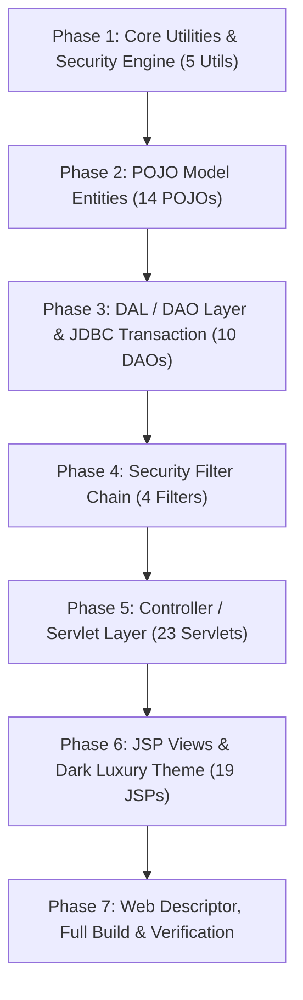

# KẾ HOẠCH TRIỂN KHAI DỰ ÁN HYPERCAR SALE SYSTEM (CẦM TAY CHỈ VIỆC)

Tài liệu này là bản thiết kế và lộ trình chi tiết từng bước (**Step-by-Step**) để **đại ca** điều khiển Agent xây dựng lại toàn bộ dự án **HyperCarSaleSystem (PRJ301)** theo chuẩn kiến trúc **MVC-V2**, phân tách tầng rành mạch, bảo mật cao cấp (jBCrypt, CSRF, XSS Filter, JDBC Transaction) và tương thích **100% Java 8 (class file version 52.0)**.

---

## 🗺️ TỔNG QUAN LỘ TRÌNH 7 GIAI ĐOẠN (PHASES)

---

## 📌 CHI TIẾT TỪNG GIAI ĐOẠN & BƯỚC THỰC HIỆN

---

### 🟢 PHASE 1: TẦNG TIỆN ÍCH CỐT LÕI & BẢO MẬT (CORE UTILITIES)

> **Mục tiêu**: Xây dựng nền tảng kết nối CSDL và các công cụ xử lý bảo mật (băm mật khẩu, chống CSRF, làm sạch XSS, định dạng dữ liệu).

#### 🔹 Bước 1.1: Tạo `dal.DBContext`
- **File**: [`src/java/dal/DBContext.java`](file:///d:/PRJ/Project/HyperCarSaleSystem/src/java/dal/DBContext.java)
- **Nội dung**:
  - Kết nối Microsoft SQL Server (`HyperCarDB`, port `1433`, driver `com.microsoft.sqlserver.jdbc.SQLServerDriver`).
  - Xử lý ném `RuntimeException` kèm thông báo lỗi rõ ràng nếu không kết nối được DB (tránh lỗi `NullPointerException` ngầm).
- **Lệnh điều khiển**:
  > *"Thực hiện Bước 1.1: Tạo file dal/DBContext.java quản lý kết nối SQL Server chuẩn chỉ."*

#### 🔹 Bước 1.2: Tạo `util.PasswordUtil` (jBCrypt)
- **File**: [`src/java/util/PasswordUtil.java`](file:///d:/PRJ/Project/HyperCarSaleSystem/src/java/util/PasswordUtil.java)
- **Nội dung**:
  - Hàm `hashPassword(String plainText)`: Băm mật khẩu bằng `org.mindrot.jbcrypt.BCrypt` với độ phức tạp 10 rounds.
  - Hàm `checkPassword(String plainText, String hashed)`: Kiểm tra khớp mật khẩu an toàn.
- **Lệnh điều khiển**:
  > *"Thực hiện Bước 1.2: Tạo file util/PasswordUtil.java sử dụng jBCrypt băm và kiểm tra mật khẩu."*

#### 🔹 Bước 1.3: Tạo `util.CSRFUtil`
- **File**: [`src/java/util/CSRFUtil.java`](file:///d:/PRJ/Project/HyperCarSaleSystem/src/java/util/CSRFUtil.java)
- **Nội dung**:
  - `generateToken(HttpSession session)`: Sinh chuỗi ngẫu nhiên UUID và lưu vào session.
  - `validateToken(HttpServletRequest request)`: So khớp token gửi lên từ form với token trong session.
- **Lệnh điều khiển**:
  > *"Thực hiện Bước 1.3: Tạo file util/CSRFUtil.java sinh và xác thực CSRF token."*

#### 🔹 Bước 1.4: Tạo `util.ValidationUtil` & `util.FormatUtil`
- **Files**:
  - [`src/java/util/ValidationUtil.java`](file:///d:/PRJ/Project/HyperCarSaleSystem/src/java/util/ValidationUtil.java): Hàm sanitize HTML chống XSS, validate Email, SĐT, số nguyên, số thực dương.
  - [`src/java/util/FormatUtil.java`](file:///d:/PRJ/Project/HyperCarSaleSystem/src/java/util/FormatUtil.java): Định dạng tiền tệ USD (`$1,234,567.00`), định dạng ngày tháng `dd/MM/yyyy HH:mm`.
- **Lệnh điều khiển**:
  > *"Thực hiện Bước 1.4: Tạo 2 file util/ValidationUtil.java và util/FormatUtil.java."*

---

### 🟢 PHASE 2: TẦNG THỰC THỂ DỮ LIỆU (POJO MODELS)

> **Mục tiêu**: Định nghĩa 14 Java class ánh xạ chính xác 1:1 với 11 bảng CSDL SQL Server và các đối tượng nghiệp vụ (Cart, CartItem).

#### 🔹 Bước 2.1: Nhóm Thực Thể Hệ Thống & Phân Loại
- **Files**:
  - [`src/java/model/Role.java`](file:///d:/PRJ/Project/HyperCarSaleSystem/src/java/model/Role.java): `roleId`, `roleName`.
  - [`src/java/model/User.java`](file:///d:/PRJ/Project/HyperCarSaleSystem/src/java/model/User.java): `userId`, `username`, `passwordHash`, `fullName`, `email`, `phone`, `address`, `roleId`, `roleName`, `status`, `createdAt`.
  - [`src/java/model/Brand.java`](file:///d:/PRJ/Project/HyperCarSaleSystem/src/java/model/Brand.java): `brandId`, `brandName`, `country`, `logoUrl`, `description`.
  - [`src/java/model/Category.java`](file:///d:/PRJ/Project/HyperCarSaleSystem/src/java/model/Category.java): `categoryId`, `categoryName`, `description`.
  - [`src/java/model/ActivityLog.java`](file:///d:/PRJ/Project/HyperCarSaleSystem/src/java/model/ActivityLog.java): `logId`, `userId`, `username`, `action`, `details`, `createdAt`.
- **Lệnh điều khiển**:
  > *"Thực hiện Bước 2.1: Tạo 5 POJO Model cơ bản (Role, User, Brand, Category, ActivityLog)."*

#### 🔹 Bước 2.2: Nhóm Thực Thể Siêu Xe & Đánh Giá
- **Files**:
  - [`src/java/model/Car.java`](file:///d:/PRJ/Project/HyperCarSaleSystem/src/java/model/Car.java): `carId`, `modelName`, `brandId`, `brandName`, `brandCountry`, `categoryId`, `categoryName`, `price`, `depositRate`, `depositAmount`, `year`, `horsepower`, `acceleration0100`, `topSpeed`, `stockQuantity`, `thumbnailUrl`, `colorOptions`, `engineSpec`, `description`, `status`, `createdAt`.
  - [`src/java/model/CarImage.java`](file:///d:/PRJ/Project/HyperCarSaleSystem/src/java/model/CarImage.java): `imageId`, `carId`, `imageUrl`, `caption`.
  - [`src/java/model/CarReview.java`](file:///d:/PRJ/Project/HyperCarSaleSystem/src/java/model/CarReview.java): `reviewId`, `userId`, `username`, `userFullName`, `carId`, `carModelName`, `rating`, `comment`, `createdAt`.
- **Lệnh điều khiển**:
  > *"Thực hiện Bước 2.2: Tạo 3 POJO Model siêu xe (Car, CarImage, CarReview)."*

#### 🔹 Bước 2.3: Nhóm Thực Thể Đơn Cọc, Giỏ Hàng & Lái Thử
- **Files**:
  - [`src/java/model/Coupon.java`](file:///d:/PRJ/Project/HyperCarSaleSystem/src/java/model/Coupon.java): `couponCode`, `discountPercent`, `maxDiscount`, `minOrderAmount`, `expiryDate`, `isActive`.
  - [`src/java/model/Order.java`](file:///d:/PRJ/Project/HyperCarSaleSystem/src/java/model/Order.java): `orderId`, `orderCode`, `userId`, `username`, `userFullName`, `totalAmount`, `depositAmount`, `couponCode`, `discountAmount`, `status`, `paymentMethod`, `deliveryAddress`, `phone`, `note`, `orderDate`, `details`.
  - [`src/java/model/OrderDetail.java`](file:///d:/PRJ/Project/HyperCarSaleSystem/src/java/model/OrderDetail.java): `detailId`, `orderId`, `carId`, `carModelName`, `carThumbnailUrl`, `quantity`, `unitPrice`, `selectedColor`, `customOptions`.
  - [`src/java/model/CartItem.java`](file:///d:/PRJ/Project/HyperCarSaleSystem/src/java/model/CartItem.java): `car`, `quantity`, `selectedColor`, `customOptions`, `subtotal`, `depositSubtotal`.
  - [`src/java/model/Cart.java`](file:///d:/PRJ/Project/HyperCarSaleSystem/src/java/model/Cart.java): `items`, `addItem()`, `removeItem()`, `updateQuantity()`, `clear()`, `getTotalAmount()`, `getDepositAmount()`, `getTotalQuantity()`.
  - [`src/java/model/TestDriveBooking.java`](file:///d:/PRJ/Project/HyperCarSaleSystem/src/java/model/TestDriveBooking.java): `bookingId`, `userId`, `username`, `userFullName`, `carId`, `carModelName`, `bookingDate`, `timeSlot`, `locationTrack`, `driverLicenseNumber`, `note`, `status`, `createdAt`.
- **Lệnh điều khiển**:
  > *"Thực hiện Bước 2.3: Tạo 6 POJO Model giao dịch (Coupon, Order, OrderDetail, CartItem, Cart, TestDriveBooking)."*

---

### 🟢 PHASE 3: TẦNG TRUY XUẤT CƠ SỞ DỮ LIỆU (DAL / DAO LAYER)

> **Mục tiêu**: Xây dựng 10 DAO classes thực thi PreparedStatements, xử lý tham số an toàn chống SQL Injection và áp dụng kỹ thuật **JDBC Transaction Management**.

#### 🔹 Bước 3.1: `dal.UserDAO` & `dal.ActivityLogDAO`
- **Files**:
  - [`src/java/dal/UserDAO.java`](file:///d:/PRJ/Project/HyperCarSaleSystem/src/java/dal/UserDAO.java): `login()`, `checkUsernameExists()`, `checkEmailExists()`, `register()`, `getUserById()`, `updateProfile()`, `changePassword()`, `getAllUsers()`, `updateStatus()`.
  - [`src/java/dal/ActivityLogDAO.java`](file:///d:/PRJ/Project/HyperCarSaleSystem/src/java/dal/ActivityLogDAO.java): `logActivity(userId, action, details)`, `getRecentLogs(limit)`.
- **Lệnh điều khiển**:
  > *"Thực hiện Bước 3.1: Tạo dal/UserDAO.java và dal/ActivityLogDAO.java."*

#### 🔹 Bước 3.2: `dal.BrandDAO` & `dal.CategoryDAO`
- **Files**:
  - [`src/java/dal/BrandDAO.java`](file:///d:/PRJ/Project/HyperCarSaleSystem/src/java/dal/BrandDAO.java): `getAllBrands()`, `getBrandById()`, `insertBrand()`, `updateBrand()`, `deleteBrand()`.
  - [`src/java/dal/CategoryDAO.java`](file:///d:/PRJ/Project/HyperCarSaleSystem/src/java/dal/CategoryDAO.java): `getAllCategories()`, `getCategoryById()`.
- **Lệnh điều khiển**:
  > *"Thực hiện Bước 3.2: Tạo dal/BrandDAO.java và dal/CategoryDAO.java."*

#### 🔹 Bước 3.3: `dal.CarDAO` & `dal.CarImageDAO`
- **Files**:
  - [`src/java/dal/CarDAO.java`](file:///d:/PRJ/Project/HyperCarSaleSystem/src/java/dal/CarDAO.java): Tìm kiếm đa điều kiện động, phân trang `OFFSET ? ROWS FETCH NEXT ? ROWS ONLY`, `getFeaturedCars()`, `getLatestCars()`, `getCarById()`, `insertCar()`, `updateCar()`, `deleteCar()`, `searchLive()`.
  - [`src/java/dal/CarImageDAO.java`](file:///d:/PRJ/Project/HyperCarSaleSystem/src/java/dal/CarImageDAO.java): `getImagesByCarId()`, `insertImage()`, `deleteImage()`.
- **Lệnh điều khiển**:
  > *"Thực hiện Bước 3.3: Tạo dal/CarDAO.java và dal/CarImageDAO.java."*

#### 🔹 Bước 3.4: `dal.CouponDAO`, `dal.ReviewDAO` & `dal.TestDriveDAO`
- **Files**:
  - [`src/java/dal/CouponDAO.java`](file:///d:/PRJ/Project/HyperCarSaleSystem/src/java/dal/CouponDAO.java): `getValidCoupon(code, orderAmount)`.
  - [`src/java/dal/ReviewDAO.java`](file:///d:/PRJ/Project/HyperCarSaleSystem/src/java/dal/ReviewDAO.java): `getReviewsByCarId()`, `hasUserReviewed()`, `insertReview()`.
  - [`src/java/dal/TestDriveDAO.java`](file:///d:/PRJ/Project/HyperCarSaleSystem/src/java/dal/TestDriveDAO.java): `bookTestDrive()`, `getBookingsByUserId()`, `getAllBookings()`, `updateStatus()`.
- **Lệnh điều khiển**:
  > *"Thực hiện Bước 3.4: Tạo dal/CouponDAO.java, dal/ReviewDAO.java và dal/TestDriveDAO.java."*

#### 🔹 Bước 3.5: `dal.OrderDAO` (Kỹ thuật JDBC Transaction)
- **File**: [`src/java/dal/OrderDAO.java`](file:///d:/PRJ/Project/HyperCarSaleSystem/src/java/dal/OrderDAO.java)
- **Nội dung kỹ thuật**:
  - `createOrderWithTransaction(Order order, Cart cart)`:
    1. `conn.setAutoCommit(false);`
    2. Insert bảng `Orders` -> Lấy `generatedOrderId` qua `Statement.RETURN_GENERATED_KEYS`.
    3. Loop từng item trong `Cart` -> Insert `OrderDetails` -> Trừ `stock_quantity` trong bảng `Cars` (Kiểm tra nếu hết hàng thì ném Exception).
    4. Ghi `ActivityLogs`.
    5. `conn.commit();`
    6. Catch `SQLException` -> `conn.rollback();`
  - Các hàm truy vấn: `getOrdersByUserId()`, `getOrderById()`, `getAllOrders()`, `updateStatus()`, `getRevenueStatistics()`.
- **Lệnh điều khiển**:
  > *"Thực hiện Bước 3.5: Tạo dal/OrderDAO.java với đầy đủ cơ chế JDBC Transaction Management."*

---

### 🟢 PHASE 4: CHUỖI BỘ LỌC BẢO MẬT (FILTER CHAIN)

> **Mục tiêu**: Đảm bảo an toàn 100% cho mọi HTTP Request/Response (UTF-8, CSRF Protection, Auth Gatekeeper, Admin RBAC).

#### 🔹 Bước 4.1: `filter.EncodingFilter` & `filter.CSRFFilter`
- **Files**:
  - [`src/java/filter/EncodingFilter.java`](file:///d:/PRJ/Project/HyperCarSaleSystem/src/java/filter/EncodingFilter.java): Set `UTF-8` cho request/response.
  - [`src/java/filter/CSRFFilter.java`](file:///d:/PRJ/Project/HyperCarSaleSystem/src/java/filter/CSRFFilter.java): Tự động cấp CSRF token vào session và request attribute `csrfToken`.
- **Lệnh điều khiển**:
  > *"Thực hiện Bước 4.1: Tạo filter/EncodingFilter.java và filter/CSRFFilter.java."*

#### 🔹 Bước 4.2: `filter.AuthFilter` & `filter.AdminFilter`
- **Files**:
  - [`src/java/filter/AuthFilter.java`](file:///d:/PRJ/Project/HyperCarSaleSystem/src/java/filter/AuthFilter.java): Chặn khách chưa đăng nhập truy cập `/profile`, `/cart`, `/checkout`, `/order-history`, `/test-drive`.
  - [`src/java/filter/AdminFilter.java`](file:///d:/PRJ/Project/HyperCarSaleSystem/src/java/filter/AdminFilter.java): Chặn người dùng không có vai trò `ADMIN` truy cập `/admin/*`.
- **Lệnh điều khiển**:
  > *"Thực hiện Bước 4.2: Tạo filter/AuthFilter.java và filter/AdminFilter.java."*

---

### 🟢 PHASE 5: TẦNG ĐIỀU PHỐI CONTROLLER (SERVLETS)

> **Mục tiêu**: Xây dựng 23 Servlet phân theo đúng chuẩn MVC-V2 (`doGet` cho render/read, `doPost` cho write/transaction/CSRF).

#### 🔹 Bước 5.1: Nhóm Servlet Xác Thực (Auth)
- **Files**:
  - `LoginController.java` (`/login`): Đăng nhập, kiểm tra jBCrypt, lưu session `currentUser`.
  - `RegisterController.java` (`/register`): Đăng ký tài khoản VIP mới.
  - `LogoutController.java` (`/logout`): Xóa session và redirect trang chủ.
  - `ProfileController.java` (`/profile`): Cập nhật thông tin cá nhân và đổi mật khẩu.
- **Lệnh điều khiển**:
  > *"Thực hiện Bước 5.1: Tạo 4 Servlet controller/auth/ (Login, Register, Logout, Profile)."*

#### 🔹 Bước 5.2: Nhóm Servlet Khách Hàng - Xem Xe & Trải Nghiệm (Client Browsing)
- **Files**:
  - `HomeController.java` (`/home`): Trang chủ, lấy top xe nổi bật, danh sách thương hiệu.
  - `CarListController.java` (`/cars`): Danh sách xe, bộ lọc giá, hãng, loại xe, phân trang.
  - `CarDetailController.java` (`/car-detail`): Chi tiết siêu xe, thông số kỹ thuật, bộ sưu tập ảnh, danh sách đánh giá.
  - `ReviewController.java` (`/submit-review`): Gửi đánh giá sao & bình luận (kiểm tra CSRF & 1 review/user).
- **Lệnh điều khiển**:
  > *"Thực hiện Bước 5.2: Tạo 4 Servlet controller/client/ (Home, CarList, CarDetail, Review)."*

#### 🔹 Bước 5.3: Nhóm Servlet Khách Hàng - Giao Dịch & Đặt Cọc (Client Transaction)
- **Files**:
  - `CartController.java` (`/cart`): Xem, thêm, cập nhật số lượng, xóa xe trong giỏ cọc.
  - `CheckoutController.java` (`/checkout`): Trang xác nhận hợp đồng đặt cọc, thực hiện gọi `OrderDAO.createOrderWithTransaction()`.
  - `OrderSuccessController.java` (`/order-success`): Hiển thị hợp đồng cọc thành công.
  - `OrderHistoryController.java` (`/order-history`): Lịch sử hợp đồng & chi tiết đơn cọc.
  - `TestDriveController.java` (`/test-drive`): Đăng ký lái thử trường đua F1 và xem lịch sử đăng ký.
- **Lệnh điều khiển**:
  > *"Thực hiện Bước 5.3: Tạo 5 Servlet controller/client/ (Cart, Checkout, OrderSuccess, OrderHistory, TestDrive)."*

#### 🔹 Bước 5.4: Nhóm Servlet Quản Trị Hệ Thống (Admin)
- **Files**:
  - `AdminDashboardController.java` (`/admin/dashboard`): Thống kê doanh thu, tổng đơn, biểu đồ Chart.js, log hoạt động.
  - `AdminCarController.java` (`/admin/cars`): CRUD siêu xe, toggle trạng thái mở bán.
  - `AdminBrandController.java` (`/admin/brands`): CRUD thương hiệu siêu xe.
  - `AdminOrderController.java` (`/admin/orders`): Quản lý & duyệt trạng thái hợp đồng cọc.
  - `AdminBookingController.java` (`/admin/bookings`): Duyệt lịch lái thử F1.
  - `AdminUserController.java` (`/admin/users`): Khóa / mở khóa tài khoản khách hàng VIP.
  - `ExportReportController.java` (`/admin/export-report`): Xuất báo cáo doanh thu ra file CSV (UTF-8 BOM).
- **Lệnh điều khiển**:
  > *"Thực hiện Bước 5.4: Tạo 7 Servlet controller/admin/ (Dashboard, Car, Brand, Order, Booking, User, ExportReport)."*

#### 🔹 Bước 5.5: Nhóm REST API AJAX Controllers
- **Files**:
  - `ApiLiveSearchController.java` (`/api/search`): Tìm kiếm siêu xe realtime dạng JSON (Jackson).
  - `ApiCheckCouponController.java` (`/api/coupon/check`): Kiểm tra mã voucher và tính tiền giảm realtime.
  - `ApiCartController.java` (`/api/cart/count`): Lấy số lượng giỏ xe hiện tại realtime.
- **Lệnh điều khiển**:
  > *"Thực hiện Bước 5.5: Tạo 3 REST API Servlet controller/api/ (LiveSearch, CheckCoupon, CartCount)."*

---

### 🟢 PHASE 6: TẦNG GIAO DIỆN NGƯỜI DÙNG (JSP VIEWS & DARK LUXURY THEME)

> **Mục tiêu**: Xây dựng 19 file JSP chuẩn giao diện Dark & Gold thượng lưu, phông chữ **`Roboto`**, độ tương phản cao, hình ảnh nạp từ local `assets/images/`.

#### 🔹 Bước 6.1: Giao Diện Dùng Chung (Common Components)
- **Files**:
  - `web/WEB-INF/views/common/header.jsp`: Khai báo HTML5, Bootstrap 5, Bootstrap Icons, Google Fonts Roboto + Cinzel, link `style.css`.
  - `web/WEB-INF/views/common/navbar.jsp`: Thanh điều hướng thượng lưu, search realtime, giỏ cọc, menu user VIP.
  - `web/WEB-INF/views/common/footer.jsp`: Chân trang thông tin showroom, liên hệ VIP.
  - `web/WEB-INF/views/common/sidebar.jsp`: Sidebar điều hướng trang quản trị Admin.
- **Lệnh điều khiển**:
  > *"Thực hiện Bước 6.1: Tạo 4 file JSP giao diện dùng chung web/WEB-INF/views/common/ (header, navbar, footer, sidebar)."*

#### 🔹 Bước 6.2: Giao Diện Xác Thực & Chuyển Hướng Gốc
- **Files**:
  - `web/index.jsp`: Chuyển hướng tự động vào `${pageContext.request.contextPath}/home`.
  - `web/WEB-INF/views/auth/login.jsp`: Form đăng nhập VIP, tài khoản demo nhanh, thông báo lỗi rõ ràng.
  - `web/WEB-INF/views/auth/register.jsp`: Form gia nhập VIP với đầy đủ trường thông tin.
- **Lệnh điều khiển**:
  > *"Thực hiện Bước 6.2: Tạo web/index.jsp và 2 trang web/WEB-INF/views/auth/ (login.jsp, register.jsp)."*

#### 🔹 Bước 6.3: Giao Diện Khách Hàng - Trang Chủ & Danh Sách Xe
- **Files**:
  - `web/WEB-INF/views/client/home.jsp`: Hero Banner local, logo 8 thương hiệu, lưới siêu xe tiêu biểu, đặc quyền VIP.
  - `web/WEB-INF/views/client/car-list.jsp`: Bộ lọc đa tiêu chí bên trái, thanh sắp xếp, phân trang và lưới xe.
  - `web/WEB-INF/views/client/car-detail.jsp`: Ảnh lớn, gallery phụ, bảng thông số kỹ thuật, form đặt cọc, phần đánh giá khách hàng.
- **Lệnh điều khiển**:
  > *"Thực hiện Bước 6.3: Tạo 3 trang web/WEB-INF/views/client/ (home.jsp, car-list.jsp, car-detail.jsp)."*

#### 🔹 Bước 6.4: Giao Diện Khách Hàng - Giỏ Cọc, Hợp Đồng & Lái Thử
- **Files**:
  - `web/WEB-INF/views/client/cart.jsp`: Bảng danh sách xe cọc, cập nhật số lượng, tổng tiền.
  - `web/WEB-INF/views/client/checkout.jsp`: Nhập thông tin giao xe, áp mã giảm giá, tính cọc 10%, chọn phương thức thanh toán.
  - `web/WEB-INF/views/client/order-success.jsp`: Thông báo ký hợp đồng đặt cọc thành công.
  - `web/WEB-INF/views/client/order-history.jsp`: Danh sách hợp đồng đặt cọc của khách hàng.
  - `web/WEB-INF/views/client/order-detail.jsp`: Chi tiết từng hợp đồng cọc và xe đã đặt.
  - `web/WEB-INF/views/client/test-drive.jsp`: Form đăng ký lịch lái thử F1 và bảng lịch hẹn cá nhân.
  - `web/WEB-INF/views/client/profile.jsp`: Hồ sơ cá nhân và đổi mật khẩu.
- **Lệnh điều khiển**:
  > *"Thực hiện Bước 6.4: Tạo 7 trang web/WEB-INF/views/client/ (cart, checkout, order-success, order-history, order-detail, test-drive, profile)."*

#### 🔹 Bước 6.5: Giao Diện Quản Trị Hệ Thống (Admin Views)
- **Files**:
  - `web/WEB-INF/views/admin/dashboard.jsp`: Thẻ KPI doanh thu, biểu đồ doanh thu Chart.js, đơn mới nhất, log hệ thống.
  - `web/WEB-INF/views/admin/car-manage.jsp`: Bảng quản lý kho siêu xe, nút thêm mới, sửa, bật/tắt bán.
  - `web/WEB-INF/views/admin/car-form.jsp`: Form thêm / sửa siêu xe chi tiết.
  - `web/WEB-INF/views/admin/brand-manage.jsp`: Quản lý thương hiệu xe.
  - `web/WEB-INF/views/admin/order-manage.jsp`: Quản lý và duyệt trạng thái các hợp đồng đặt cọc.
  - `web/WEB-INF/views/admin/booking-manage.jsp`: Duyệt lịch lái thử của khách hàng.
  - `web/WEB-INF/views/admin/user-manage.jsp`: Quản lý danh sách thành viên VIP, khóa/mở tài khoản.
- **Lệnh điều khiển**:
  > *"Thực hiện Bước 6.5: Tạo 7 trang web/WEB-INF/views/admin/ (dashboard, car-manage, car-form, brand-manage, order-manage, booking-manage, user-manage)."*

---

### 🟢 PHASE 7: CẤU HÌNH DESCRIPTOR, BIÊN DỊCH & CHẠY THỬ NGHIỆM

> **Mục tiêu**: Hoàn thiện cấu hình `web.xml`, biên dịch toàn bộ mã nguồn kiểm tra 0 lỗi và nghiệm thu toàn diện.

#### 🔹 Bước 7.1: Cấu hình `web/WEB-INF/web.xml`
- **File**: [`web/WEB-INF/web.xml`](file:///d:/PRJ/Project/HyperCarSaleSystem/web/WEB-INF/web.xml)
- **Nội dung**: Khai báo đầy đủ 4 Filters (theo đúng thứ tự lọc) và 23 Servlet mappings.
- **Lệnh điều khiển**:
  > *"Thực hiện Bước 7.1: Tạo cấu hình web/WEB-INF/web.xml hoàn chỉnh."*

#### 🔹 Bước 7.2: Biên Dịch Kiểm Thử Toàn Bộ Java Classes
- **Lệnh thực hiện**: Biên dịch toàn bộ bằng `javac` với classpath của 8 JARs Java 8.
- **Tiêu chuẩn đạt**: **56/56 file Java biên dịch thành công, 0 lỗi compile**.
- **Lệnh điều khiển**:
  > *"Thực hiện Bước 7.2: Chạy biên dịch kiểm tra toàn bộ 56 file Java."*

#### 🔹 Bước 7.3: Hướng Dẫn Chạy & Nghiệm Thu
- Khởi động **SQL Server**, chạy file [`database/HyperCarDB.sql`](file:///d:/PRJ/Project/HyperCarSaleSystem/database/HyperCarDB.sql).
- Mở **NetBeans** -> Chuột phải **`HyperCarSaleSystem`** -> Chọn **`Clean and Build`** -> Nhấn **`F6` (Run)**.
- **Lệnh điều khiển**:
  > *"Thực hiện Bước 7.3: Tổng kết và hướng dẫn nghiệm thu dự án."*

---

## 🎯 BẢNG TỔNG HỢP TIẾN ĐỘ THỰC HIỆN

| Giai Đoạn | Số Bước | Số File Code | Trạng Thái |
|---|:---:|:---:|:---:|
| **Phase 1: Core Utilities & Security** | 4 bước | 5 file `.java` | ⏳ Chờ đại ca ra lệnh |
| **Phase 2: POJO Model Entities** | 3 bước | 14 file `.java` | ⏳ Chờ đại ca ra lệnh |
| **Phase 3: DAL / DAO & Transactions** | 5 bước | 10 file `.java` | ⏳ Chờ đại ca ra lệnh |
| **Phase 4: Security Filter Chain** | 2 bước | 4 file `.java` | ⏳ Chờ đại ca ra lệnh |
| **Phase 5: Controller / Servlets** | 5 bước | 23 file `.java` | ⏳ Chờ đại ca ra lệnh |
| **Phase 6: JSP Views & Dark Theme** | 5 bước | 19 file `.jsp` | ⏳ Chờ đại ca ra lệnh |
| **Phase 7: Web Descriptor & Build** | 3 bước | 1 file `web.xml` | ⏳ Chờ đại ca ra lệnh |
